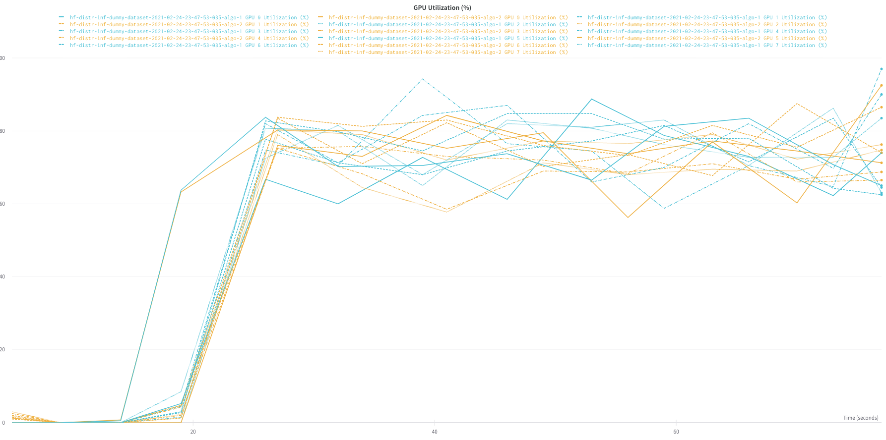
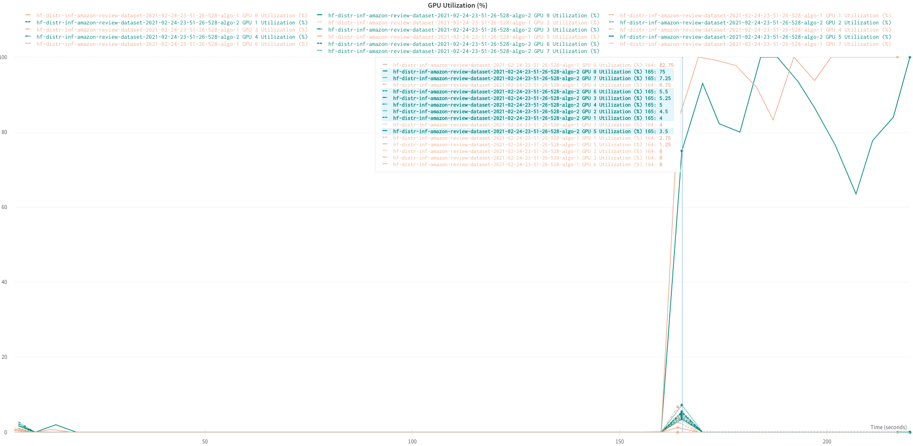

# transformers-inference-on-sagemaker
A sample repo to show how to optimize NLP inference on Amazon SageMaker

# Backlog
1. Add inference code (rank aware) to perform classification pipeline - done.
2. Add data loader (rank aware) to load the financial sentiment dataset - done.
3. Add support of SPOT instance (specifically, pay attention to checkpointing)
4. Add relevant metrics (end-to-end inference time, inference cost, ???)
5. Do testing/benchmarking on G4s (single-device and multi-device) and P3s (multi-gpu)

## Current issues:
1. One of samples in Amazon Review dataset is violating max_lenght=512, which causes failure. Need to restrict max_length for all dataset samples.
2. After profiling of inference, we observered following behavior:
- For dummy dataloader (always returns one sample stored in memory) we see that all GPUs are highy utilized; 
 
- For real dataloader using HuggingFace Dataset "amazon_polarity", only single GPU per node is fully utilized. Hence, we need to look into optimizing data loading. 
 